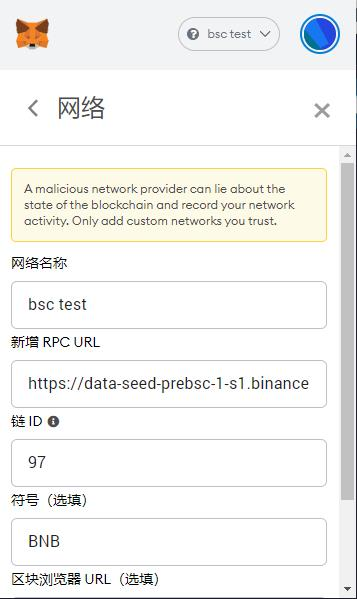

## 边缘节点挖矿

### 安装go语言环境
参考  https://golang.google.cn/doc/install  

### 编译代码

取代码
```
git clone https://github.com/filepp/go-ipfs
```

linux
```
cd go-ipfs
make build
cp cmd/ipfs /usr/local/bin
```

windows  
```
cd go-ipfs
go build cmd/ipfs  
go run github.com/GeertJohan/go.rice/rice append --exec ipfs.exe -i ./miner/build
```

### 初始化

通过环境变量IPFS_PATH配置工作目录  
linux
```
export IPFS_PATH=/data/ipfs
```
windows
```
set IPFS_PATH=D:\\ipfs
```

```
ipfs init
```

### 运行IPFS矿工节点

运行ipfs，需要指定矿工角色,(miner-role=1代表边缘节点)
```
ipfs daemon --enable-pubsub-experiment=true --enable-mining=true --miner-role=0
```

查看 PeerID， 记录下来，后面会用到。
```
ipfs id
```

### 调用合约创建矿工

-  使用chrome浏览器，安装 [MetaMask](https://metamask.io/) 钱包 

-  MetaMask添加自定义网络（BSC测试网）
```
https://data-seed-prebsc-1-s1.binance.org:8545/
链ID： 97 
```
如图：



-  从水龙头领取NBN测试币  
```
  https://testnet.binance.org/faucet-smart
```
   
- 打开创建矿工页面，连接钱包
```
   http://fc.filep.vip:7777/
```

- 用BNB兑换10个FC。 点 `Exchange FC Tokens`, 输入10。 

- 创建矿工。 点 ``Create Miner`, 填入钱包地址和ipfs节点的PeerID（上面的步骤），点击`Create FC miner`按钮