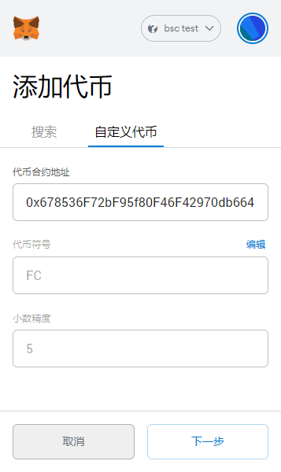

## 边缘节点挖矿

### linux环境部署IPFS

安装go语言环境  
参考  https://golang.google.cn/doc/install  

拉取代码
```
git clone https://github.com/filepp/go-ipfs
```

编译
```
cd go-ipfs
make build
cp cmd/ipfs/ipfs /usr/local/bin
```


通过环境变量IPFS_PATH配置工作目录 (确保/data/ipfs目录存在)。
```
export IPFS_PATH=/data/ipfs
```

初始化节点
```
ipfs init
```

运行ipfs，需要指定矿工角色,(miner-role=1代表边缘节点)
```
ipfs daemon --enable-pubsub-experiment=true --enable-mining=true --miner-role=1
```

查看 PeerID， 记录下来，后面会用到。（注意环境变量 IPFS_PATH 要与上面配置的一致）
```
ipfs id
```


### windows环境部署IPFS

下载 [ipfs.exe](http://122.9.61.5:8888/down/k1OB9gZGiKwD)

通过环境变量IPFS_PATH配置工作目录  
```
set IPFS_PATH=D:\ipfs
```

在ipfs.exe文件目录，执行以下命令，初始化节点
```
ipfs init
```

运行ipfs，需要指定矿工角色,(miner-role=1代表边缘节点)
```
ipfs daemon --enable-pubsub-experiment=true --enable-mining=true --miner-role=1
```

查看 PeerID， 记录下来，后面会用到。（注意环境变量 IPFS_PATH 要与上面配置的一致）
```
ipfs id
```

### 调用合约创建矿工

-  使用chrome浏览器，安装 [MetaMask](https://metamask.io/) 钱包 

-  MetaMask添加自定义网络（BSC测试网）
```
https://data-seed-prebsc-1-s1.binance.org:8545/
链ID： 97 
```
如图：


-  从水龙头领取BNB测试币  
```
  https://testnet.binance.org/faucet-smart
```
   
- 打开创建矿工页面，连接钱包
```
   http://fc.filep.vip:7777/
```

- 用BNB兑换10个FC。 点 `Exchange FC Tokens`, 输入10。 在MetaMask中添加代码，输入合约地址  

`0x678536F72bF95f80F46F42970db664D06554cb7e`, 可以看到领取的FC



- 创建矿工。 点 `Create Miner`, 填入钱包地址和ipfs节点的PeerID（上面的步骤），点击`Create FC miner`按钮

- 矿工运行几十分钟后，通过 `Get FC tokens` 页面领取挖到的FC